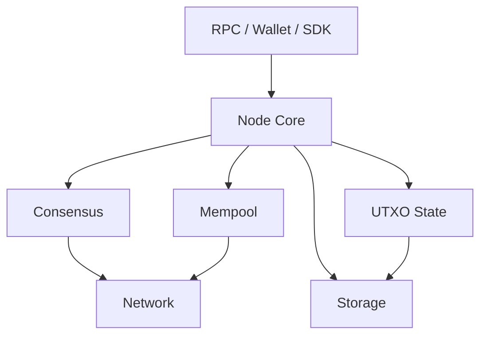

# Architecture Overview

## Purpose

This document defines the high-level architecture of the Arkon reference implementation. It describes the major subsystems, trust boundaries, data flow, and module responsibilities required to implement a production-grade node.

## 1. System Layers

Arkon is organized into the following layers:

1. Interface Layer
   - RPC endpoints
   - Wallet integration
   - Developer APIs
2. Application Layer
   - Mempool
   - Validator management
   - Governance logic
3. Protocol Layer
   - Transactions
   - Blocks
   - UTXO state transitions
   - Consensus
4. Network Layer
   - Peer discovery
   - Message routing
   - Block and transaction propagation
5. Storage Layer
   - Block storage
   - UTXO database
   - Metadata indexing

## 2. Core Components

| Component | Responsibility |
| --- | --- |
| blockchain | Manages chain state, blocks, heights, and fork policy |
| transaction | Validates and processes transactions |
| utxo | Maintains the UTXO set and spends/creates semantics |
| crypto | Implements signing, hashing, address derivation, and commitments |
| consensus | Executes BFT voting, block finalization, and view changes |
| network | Handles peer communication and message propagation |
| storage | Persists blocks, state, indexes, and snapshots |
| mempool | Accepts pending transactions and applies replacement rules |
| rpc | Exposes node services to clients |
| wallet | Derives keys, signs transactions, and manages addresses |
| staking | Tracks validator stakes and delegation |
| slashing | Detects and penalizes misbehavior |
| governance | Handles proposal lifecycle and parameter updates |
| metrics | Exposes telemetry and performance data |

## 3. Execution Flow

A transaction enters the node through the network or an RPC call. It is validated against the current UTXO state and mempool policy, then propagated to peers. A validator may include it in a proposal. If the network reaches the required quorum, the block is committed and the new UTXO set becomes the canonical state.

## 4. Design Goals

- Isolation of protocol rules from I/O concerns
- Deterministic validation logic
- Clear boundaries between consensus and execution
- Support for future VM and smart contract upgrades

## 5. Implementation Requirements

The implementation must preserve deterministic behavior across nodes, maintain stable serialization formats, and use explicit state transition rules to prevent divergence.
