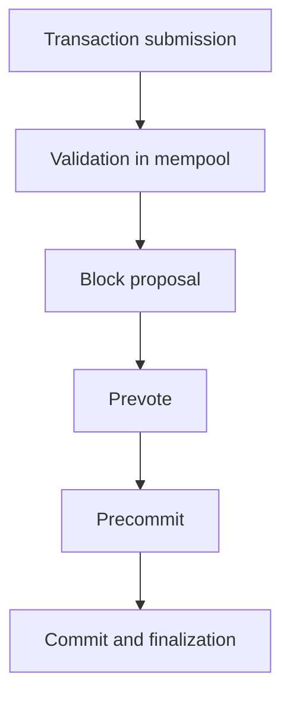

# Arkon Network (ARKN) Whitepaper v1.0

## Abstract

Arkon Network (ARKN) is an open-source Layer-1 blockchain protocol designed for secure, scalable, and decentralized digital asset infrastructure. The system combines an Extended UTXO ledger model, Tendermint-style BFT consensus, modern cryptographic primitives, and a Rust-based production implementation to achieve fast finality, deterministic execution, and strong safety guarantees.

## 1. Purpose

Arkon exists to provide a general-purpose settlement layer for programmable value transfer with the following design goals:

- Security under Byzantine behavior
- Decentralization through stake-based validation
- High throughput with efficient transaction processing
- Fast finality without chain reorganizations
- Developer-friendly interfaces and formal protocol clarity

## 2. Design Principles

Arkon is defined by the following principles:

1. Deterministic state transition
2. Strong cryptographic authorization
3. Byzantine fault tolerance with explicit quorum rules
4. UTXO-based ledger semantics for predictable accounting
5. Configurable economic and protocol parameters

## 3. Core Technical Decisions

| Area | Decision |
| --- | --- |
| Ledger model | Extended UTXO (eUTXO) |
| Consensus | Proof-of-Stake BFT with Tendermint-style voting |
| Finality | Instant finality after commit |
| Fault model | $n = 3f + 1$, tolerate up to $f$ Byzantine validators |
| Signature scheme | Ed25519 for transactions |
| Validator aggregation | BLS12-381 |
| Hash function | BLAKE3 |
| Merkle structure | Binary Merkle Tree |
| Production implementation | Rust |
| Specification language | Haskell |

## 4. Protocol Overview

Arkon organizes computation into blocks. Each block contains a set of transactions and a cryptographic commitment to the resulting state. Validators propose and confirm blocks using a two-phase voting process that ensures agreement before finalization. The protocol is designed so that once a block is committed, it is final and no conflicting block at that height can be accepted.

## 5. Ledger Model

Arkon uses an Extended UTXO model. Each transaction consumes existing UTXOs and creates new UTXOs. A UTXO contains:

- Transaction reference
- Output index
- Amount
- Owner address
- Locking conditions

The state transition function is:

$$
\text{State}_{t+1} = \text{State}_t - \text{SpentUTXOs} + \text{CreatedUTXOs}
$$

## 6. Consensus Model

Consensus uses a weighted Proof-of-Stake validator system. Validators are selected through weighted round-robin proposer scheduling based on stake. The protocol proceeds through proposal, prevote, precommit, commit, and finalization phases. A block is committed when more than $2/3$ of voting power has participated in the required phase.

## 7. Cryptography

Arkon defines a cryptographic suite suitable for both user-facing wallets and validator infrastructure:

- Ed25519 for transaction signatures
- BLS12-381 for aggregated validator signatures
- BLAKE3 for hashing and commitments
- Binary Merkle Trees for transaction inclusion proofs

## 8. Networking

Nodes communicate over a decentralized peer-to-peer network using a message-oriented protocol. QUIC is preferred for transport. Network messages include HELLO, PING, PONG, GET_BLOCKS, SEND_BLOCK, NEW_TRANSACTION, VOTE, COMMIT, SYNC_REQUEST, and SYNC_RESPONSE.

## 9. Node Architecture

The reference implementation is organized as a Rust node with modules for blockchain logic, transaction processing, cryptography, consensus, networking, storage, mempool, RPC, wallet, staking, slashing, governance, and metrics.

## 10. Token Economics

The native token is ARKN. It serves as the unit of value for transaction fees, staking, validator incentives, and governance participation. All economic parameters are configurable and should be tuned according to deployment and governance policy.

## 11. Future Compatibility

Arkon is designed for future extensibility. Although smart contracts are not implemented in this version, the protocol has forward compatibility for a virtual machine layer, contract execution semantics, and developer SDKs.

## 12. Implementation Status

This document defines the initial protocol and implementation specification for Arkon Network. The design is intended to guide the first Rust-based node implementation, reference Haskell specification, and future ecosystem development.
